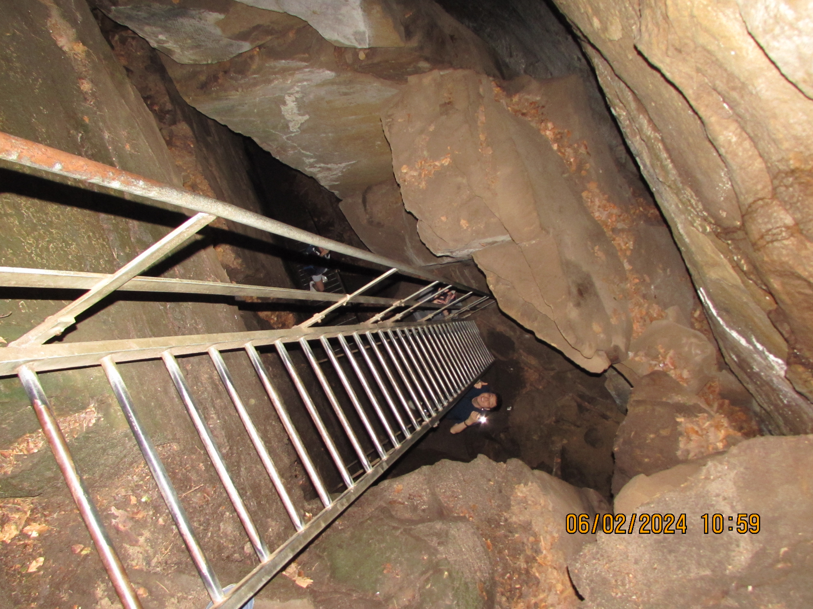
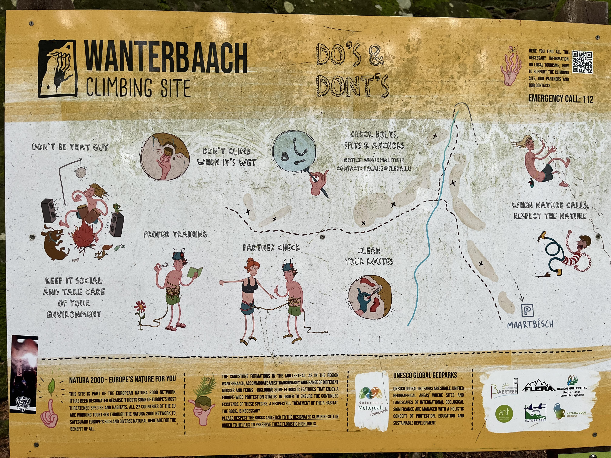

## Extraordinary Exploration

Sunday June 2nd was a great day! 
I woke up at 7:25 AM, took a quick shower, and headed to breakfast. 
I had breakfast with Michael, Dr. Gerber, Seamus and others and my hotel buffet breakfast consisted of about half a kilo of croissants,
a hot mug of coffee, and some cereal. Michael, Melody, Andy, and I had planned on going hiking today, so once I was done 
with my high Carb breakfast, I made myself two sandwiches. These consisted of small bread loafs with buttered insides, and two slices
of ham and cheese each. When our preparations for lunch were done, and with camera bag in hand, we set off for the bus stop. 
We got on a Luxembourgish bus at around 9:30 AM, and landed in the North Eastern city of [Berdorf](https://www.visitluxembourg.com/place/berdorf)
around an hour later. It took us another 10 minutes to get from the bus stop to the trail head for the first hike of the day. 
The Räuberhöhle trail is a trail that winds through the Berdorf forest and has lots of changes of scenery throughout. From nearly
crawling through thin passage ways nestled between rocks, to open clearings with massive rock walls looming down on you, it's just
a great trail. Going back to the squeezing through rocks, we had to squeeze through a pitch black hole to get to a set of rickety, and
wet, metal ladders:

After this discovery, we continued through the luscious green forest trail and eventually ended up at the Wanterbaach climbing site:

This area had dozens of climbers lead-roping from just about every conceivable place and during this mostly sunny day, the trees provided
respite for the sweaty athletes.
Finishing this trail took just about another 30 minutes, and by 12:00 PM, we were back on the road, heading towards a bus stop.
The adventure wouldn't end here though, and instead, it took another 15 minutes to reach the city of [Beaufort](https://www.visitluxembourg.com/fr/attraction/beaufort).
The main attraction (aside from an amazing hike) in this old city is a 12th century castle built in a neo-Gothic style. 
While walking around these ruins, we saw many incredible rooms, including the castle's prison, well, defensive tower, and even a torture chamber!
There was lots of other things in this château including dining rooms and bedrooms, but in the interest of time I'll focus on the
item that this château is most well known for; its black currant liqueur. Melody bought a small 4cL bottle to bring back to Luxembourg,
but we each had a sip of it, and wow, it was good!

